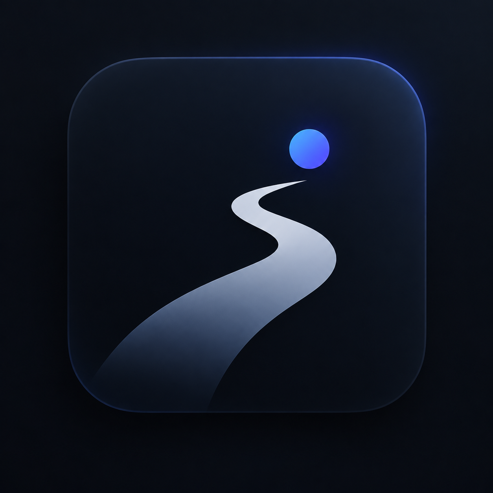
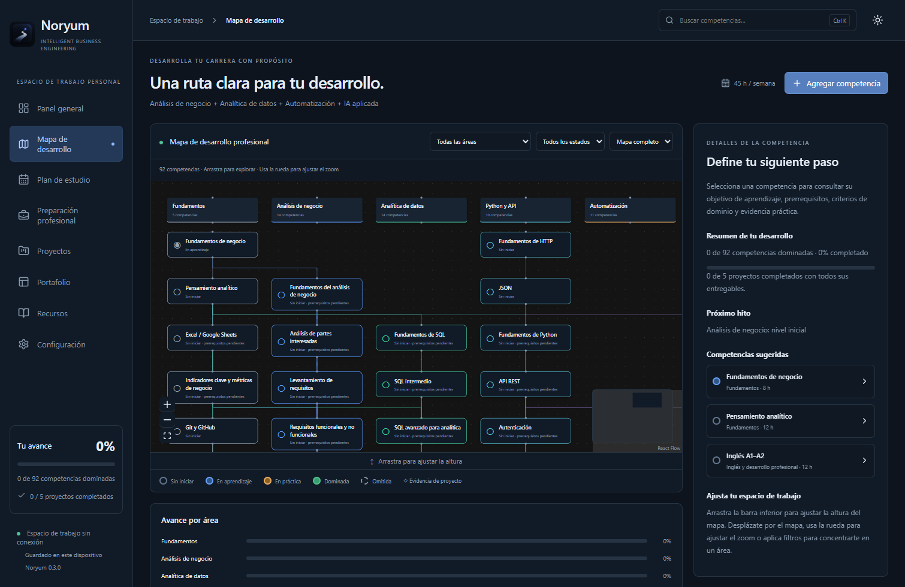
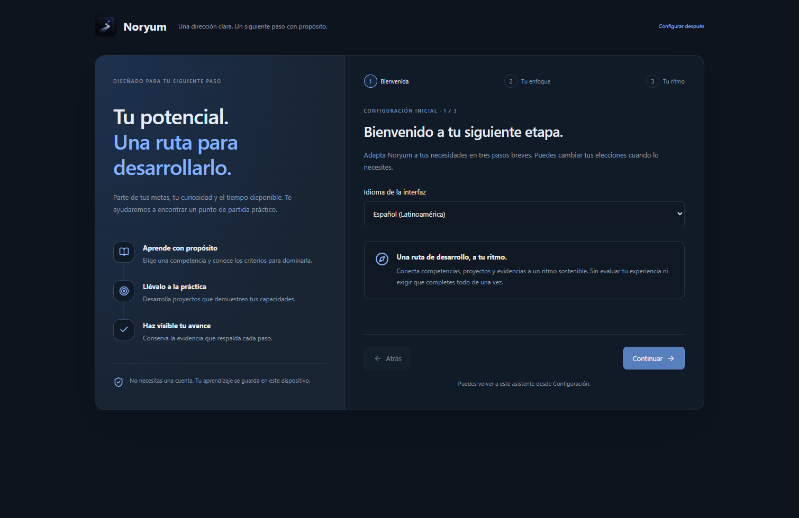

<p align="center">
  
</p>

<h1 align="center">Noryum</h1>
<p align="center"><strong>Intelligent Business Engineering</strong></p>
<p align="center">Turn your learning into a clear path from skills to project evidence.</p>
<p align="center"><a href="https://github.com/dnmmraadev/Noryum/releases/tag/v0.4.0">Download v0.4.0</a> · <a href="docs/USER_GUIDE.md">User guide</a> · <a href="https://github.com/dnmmraadev/Noryum/issues">Get help</a></p>

## Build skills with a destination

Noryum is an offline Windows workspace that connects **Business Analysis, Data Analytics, Automation and Applied AI** into one visual career roadmap. See what to learn next, practice through projects, and track the evidence behind your progress. English and career skills develop alongside your technical work.

**No account. No subscription. No API key. Your progress stays on your computer.**



## Start with a little direction

New workspaces open a short guided setup: choose your language, starting area and study rhythm, then open a practical first competency. Skip it when you prefer to explore, or reopen it from Settings. Existing workspaces and progress are preserved.



## What you can do

- **See the whole journey:** explore 92 competencies across seven tracks with prerequisites, search, filters, zoom and a minimap.
- **Know your next step:** get a study queue based on prerequisites, priorities and your available study time.
- **Learn by building:** organize five projects with deliverable checklists, notes and evidence links.
- **Track meaningful progress:** work toward five checkpoints that combine competencies and completed project evidence.
- **Choose your language:** switch between English and professional Latin American Spanish, including the built-in curriculum. Personal notes and custom content remain as written.
- **Arrange your workspace:** resize the map vertically and keep competency details visible with an informative overview.
- **Make it your own:** edit skills, add custom competencies and resources, adjust your study pace, and choose a light or dark theme.
- **Keep control of your work:** save locally and export or restore a validated JSON backup.

## Download and start

1. Download **Noryum-0.4.0-Windows-x64.zip** from the [v0.4.0 release](https://github.com/dnmmraadev/Noryum/releases/tag/v0.4.0).
2. Extract the **entire ZIP** into a folder.
3. Open **Noryum.exe** inside the Noryum folder. Keep its companion files together.
4. Choose a competency in Roadmap, set its learning state, and use Study plan to continue.

Requires Windows 10/11 x64. Node.js is not required to run the download. The application is unsigned; Windows may show a publisher warning. Internet access is only needed for optional external learning resources.

If you previously used the Career Roadmap build, its local progress directory remains compatible. If upgrading from the older Noryum 0.1.x application, export and keep your old data first: automatic migration from that different application has not been verified. See the [backup and recovery guide](docs/USER_GUIDE.md#local-data-recovery-and-backups).

Choose **Settings → Interface language → Español (Latinoamérica)** to use Spanish. Your language preference is saved on this device. The sidebar displays the current app version.

## Designed for focused, independent learning

Noryum is a single-user planning tool. It does not call cloud AI services, collect telemetry, or require paid APIs. Applied AI is a learning track. Competency states are self-assessed, and checkpoint readiness is a planning aid, not a certification or employment guarantee.

Cloud sync, a time tracker, an auto-updater and automatic skills assessment are outside this release. Evidence files are linked, not embedded in backups.

## Documentation

| I want to… | Start here |
| --- | --- |
| Understand the first-run setup | [Guided setup](docs/ONBOARDING.md) |
| Understand progress, checkpoints and backups | [User guide](docs/USER_GUIDE.md) |
| Run, test or package the source | [Development guide](docs/DEVELOPMENT.md) |
| Understand release numbers and local folders | [Versioning](docs/VERSIONING.md) |
| See what changed | [Changelog](CHANGELOG.md) |
| Report a bug or suggest an improvement | [Contributing](CONTRIBUTING.md) |
| Understand security reporting | [Security policy](SECURITY.md) |
| Review the identity and compatibility decisions | [Branding](BRANDING.md) |
| See completed checks and limitations | [Verification record](VERIFICATION.md) |

## Run from source

Use Node.js 24 LTS and a recent npm on Windows x64:

```sh
npm ci --legacy-peer-deps
npm run build
npm run desktop
```

For browser development, run `npm run dev` and open `http://127.0.0.1:5173`. Browser preview data is separate from desktop data. See the [development guide](docs/DEVELOPMENT.md) for checks and packaging.

Built with React, TypeScript, React Flow and Electron. Maintained by [dnmmraadev](https://github.com/dnmmraadev).

## License

The existing [Noryum license](LICENSE) applies. Source availability does not grant an open-source license. Third-party components retain their own licenses; the Windows distribution includes Electron's license notices.
